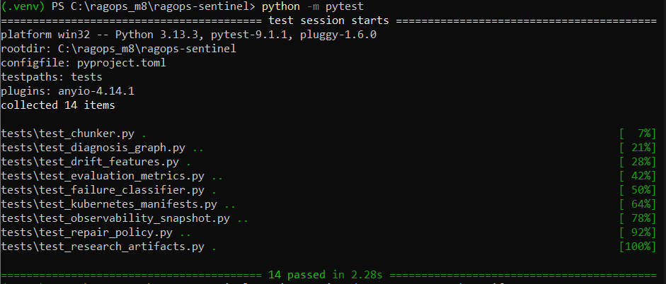
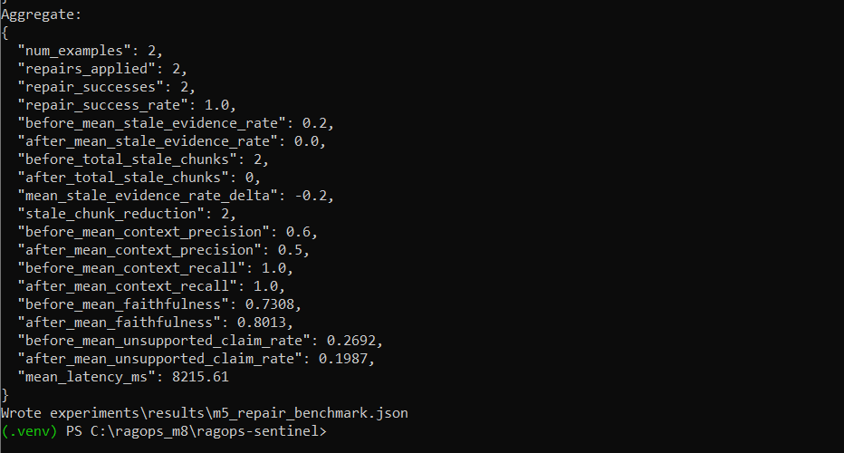
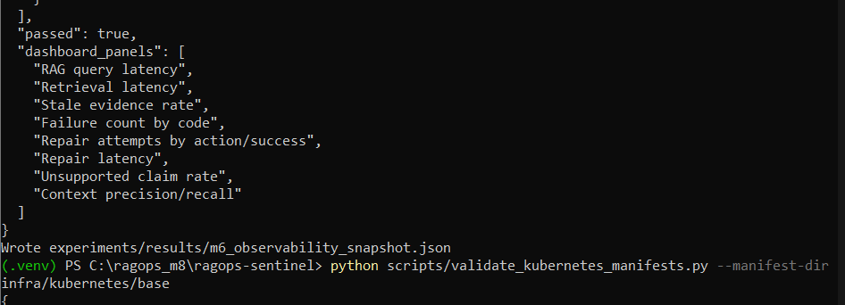
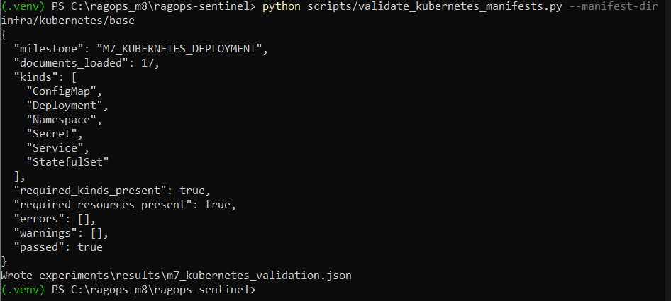
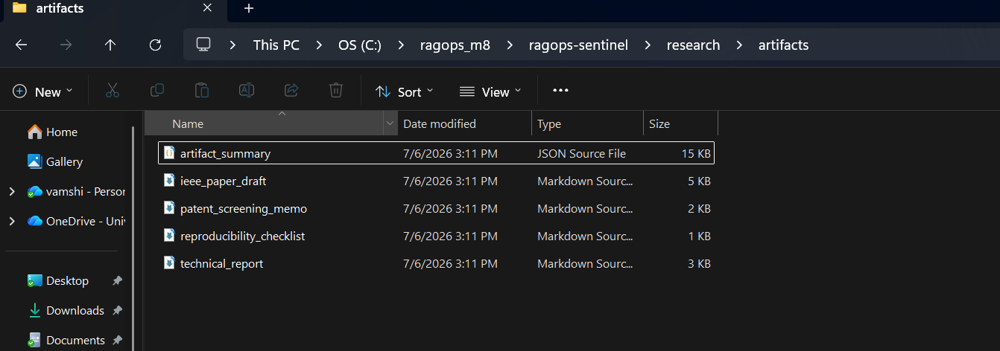
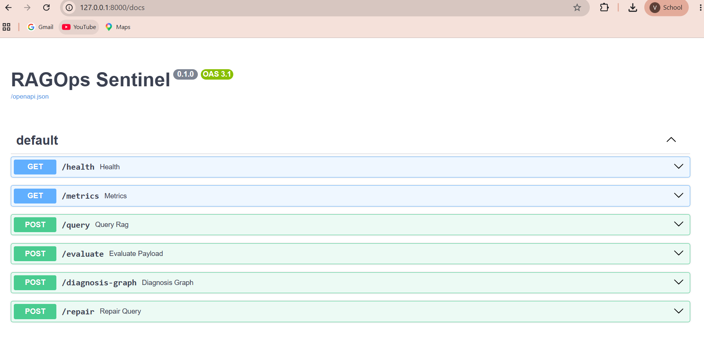
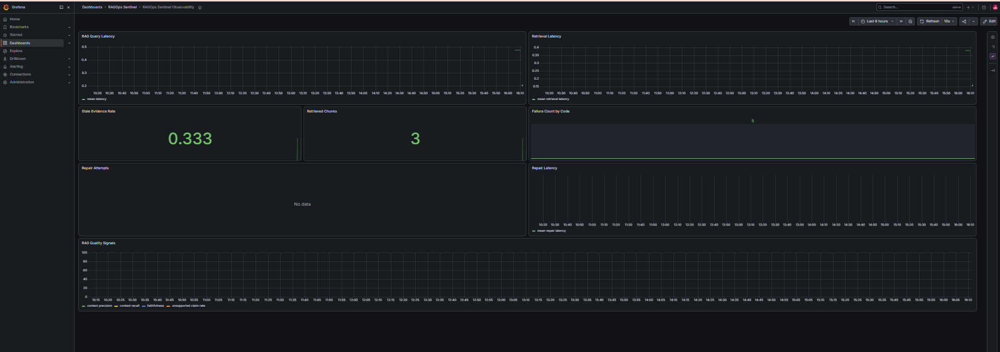

# RAGOps Sentinel

**Evidence-Drift-Aware Failure Diagnosis and Targeted Repair for Production-Style Retrieval-Augmented Generation Systems**

RAGOps Sentinel is a research-grade AI/ML systems prototype for diagnosing and repairing reliability failures in Retrieval-Augmented Generation systems. The project focuses on a production-relevant RAG failure mode: a system may retrieve stale, conflicting, incomplete, or wrong-version evidence while still returning a fluent answer.

This repository implements a reproducible prototype pipeline covering baseline RAG, evaluation, evidence-drift benchmarking, diagnosis graphs, targeted repair, observability, Kubernetes manifests, and publication/patent-screening artifacts.

---

## Project Status

This repository contains a completed and locally verified research prototype.

| Milestone | Component                               | Status   |
| --------- | --------------------------------------- | -------- |
| M1        | Baseline RAG system                     | Complete |
| M2        | Evaluation layer                        | Complete |
| M3        | Evidence-drift benchmark                | Complete |
| M4        | Sentinel Diagnosis Graph                | Complete |
| M5        | Targeted repair policy                  | Complete |
| M6        | Observability and SLO snapshot          | Complete |
| M7        | Kubernetes manifests                    | Complete |
| M8        | Research and patent-screening artifacts | Complete |

Local validation:

```text
14 passed
```

---

## Problem

Modern RAG systems can fail even when retrieval appears operationally healthy. In evolving technical documentation, incident runbooks, policy documents, or operational knowledge bases, retrieved evidence may be:

* outdated,
* superseded by a newer version,
* semantically similar but operationally wrong,
* conflicting with another valid source,
* missing from the index,
* retrieved correctly but misused by the generator.

RAGOps Sentinel treats evidence quality, versioning, retrieval behavior, evaluation signals, and operational telemetry as first-class components of a diagnosable AI system.

---

## Core Research Question

Can a production-style RAGOps layer improve RAG reliability by detecting evidence-drift-induced failures, localizing their root cause, and applying targeted repair actions instead of blindly rerunning the full RAG pipeline?

---

## Key Contributions

### 1. Versioned Evidence Ingestion

Documents are ingested with document IDs, version IDs, freshness status, validity windows, and metadata.

### 2. Evidence-Drift Benchmark

The project includes controlled stale-evidence and wrong-version retrieval fixtures.

### 3. Sentinel Diagnosis Graph

A graph representation links:

* user queries,
* retrieved chunks,
* document versions,
* answer outputs,
* evaluation metrics,
* telemetry,
* failure diagnosis,
* repair recommendations.

### 4. Targeted Repair Policy

The first implemented repair policy detects stale evidence and applies temporal/latest-version retrieval.

### 5. Observability Layer

The project includes Prometheus-compatible metrics and Grafana dashboard provisioning.

### 6. Kubernetes-Ready Deployment Manifests

The repository includes Kubernetes manifests for the API, Qdrant, Postgres, MLflow, Prometheus, and Grafana.

### 7. Research Artifacts

The project generates:

* technical report,
* IEEE-style paper draft,
* reproducibility checklist,
* patent-screening memo,
* artifact summary.

---

## Architecture

```text
User Query
   |
   v
FastAPI Query Endpoint
   |
   v
Baseline / Temporal Retrieval
   |
   +--> Qdrant Vector Store
   +--> Versioned Metadata Store
   +--> Evidence Freshness Logic
   |
   v
Answer Generation
   |
   v
Evaluation Layer
   |
   +--> Context Precision
   +--> Context Recall
   +--> Answer Relevance
   +--> Approximate Faithfulness
   +--> Unsupported Claim Rate
   |
   v
Sentinel Diagnosis Graph
   |
   +--> Stale Evidence Detection
   +--> Conflicting Version Detection
   +--> Failure Code Assignment
   +--> Risk Score
   |
   v
Repair Policy
   |
   +--> Temporal Filter Retrieval
   +--> Regenerated Answer
   +--> Before/After Metrics
   |
   v
Observability
   |
   +--> Prometheus Metrics
   +--> Grafana Dashboard
   +--> SLO Snapshot
```

---

## Technology Stack

| Area                | Tools                                         |
| ------------------- | --------------------------------------------- |
| API                 | FastAPI, Uvicorn                              |
| Retrieval           | Qdrant                                        |
| Metadata            | SQLAlchemy, SQLite/Postgres-compatible design |
| Evaluation          | Custom deterministic evaluation layer         |
| Observability       | Prometheus, Grafana                           |
| Experiment Tracking | MLflow scaffold                               |
| Deployment          | Docker Compose, Kubernetes manifests          |
| Testing             | Pytest                                        |
| Research Artifacts  | Markdown reports, JSON result files           |

---

## Experimental Results

### M5 Repair Benchmark

The targeted repair benchmark tested stale-evidence failures using controlled evidence-drift fixtures.

| Metric                      | Before Repair | After Repair |
| --------------------------- | ------------: | -----------: |
| Mean stale evidence rate    |          0.20 |         0.00 |
| Total stale chunks          |             2 |            0 |
| Repair success rate         |             — |         1.00 |
| Mean context recall         |          1.00 |         1.00 |
| Mean faithfulness           |        0.7308 |       0.8013 |
| Mean unsupported claim rate |        0.2692 |       0.1987 |

### Interpretation

Temporal-filter repair removed stale evidence in the controlled benchmark and improved approximate faithfulness and unsupported-claim rate. Context precision decreased slightly, which is reported as a limitation rather than hidden.

---

## Screenshots

### Test Validation



### Repair Benchmark



### Observability Snapshot



### Kubernetes Validation



### Research Artifacts



### FastAPI Docs



### Grafana Dashboard



---

## Repository Structure

```text
ragops-sentinel/
  apps/
    api/
      main.py
      routes/
  ragops/
    ingestion/
    retrieval/
    generation/
    evaluation/
    sentinel/
    observability/
  scripts/
    ingest_docs.py
    ingest_drift_fixture.py
    run_evaluation.py
    run_drift_benchmark.py
    run_repair_benchmark.py
    run_observability_smoke.py
    validate_kubernetes_manifests.py
    generate_research_artifacts.py
  data/
    raw/
    eval/
  experiments/
    results/
    diagnosis_graphs/
  infra/
    kubernetes/
    prometheus/
    grafana/
  research/
    artifacts/
  assets/
    screenshots/
  tests/
```

---

## Quick Start

### 1. Clone the repository

```bash
git clone https://github.com/VAMSHI-GADDI/ragops-sentinel.git
cd ragops-sentinel
```

### 2. Create a virtual environment

```bash
python -m venv .venv
```

Windows PowerShell:

```powershell
Set-ExecutionPolicy -Scope Process -ExecutionPolicy Bypass
.\.venv\Scripts\Activate.ps1
```

Linux/macOS:

```bash
source .venv/bin/activate
```

Install dependencies:

```bash
python -m pip install --upgrade pip
pip install -r requirements.txt
```

### 3. Start services

```bash
docker compose up -d qdrant postgres mlflow prometheus grafana
```

### 4. Run tests

```bash
python -m pytest
```

Expected result:

```text
14 passed
```

### 5. Ingest documents

```bash
python scripts/reset_local_state.py
python scripts/ingest_docs.py --raw-dir data/raw
python scripts/ingest_drift_fixture.py
```

### 6. Run benchmarks

```bash
python scripts/run_evaluation.py --eval-set data/eval/baseline_eval_set.jsonl --top-k 3
python scripts/run_drift_benchmark.py --eval-set data/eval/evidence_drift_eval_set.jsonl --top-k 5
python scripts/run_repair_benchmark.py --eval-set data/eval/evidence_drift_eval_set.jsonl --top-k 5
python scripts/run_observability_smoke.py --repair-result experiments/results/m5_repair_benchmark.json
python scripts/validate_kubernetes_manifests.py --manifest-dir infra/kubernetes/base
python scripts/generate_research_artifacts.py
```

### 7. Start API

```bash
uvicorn apps.api.main:app --reload --port 8000
```

Open:

```text
http://127.0.0.1:8000/docs
```

### 8. Open Grafana

```text
http://localhost:3000
```

Default local login:

```text
admin / admin
```

Dashboard:

```text
RAGOps Sentinel Observability
```

---

## API Endpoints

| Endpoint                | Purpose                         |
| ----------------------- | ------------------------------- |
| `GET /health`           | Service health check            |
| `GET /metrics`          | Prometheus metrics              |
| `POST /query`           | Run baseline RAG query          |
| `POST /evaluate`        | Evaluate an answer/evidence set |
| `POST /diagnosis-graph` | Generate diagnosis graph        |
| `POST /repair`          | Apply targeted repair policy    |

---

## Research Artifacts

Generated files are available under:

```text
research/artifacts/
```

Included artifacts:

| File                           | Purpose                                 |
| ------------------------------ | --------------------------------------- |
| `artifact_summary.json`        | Summary of generated evidence artifacts |
| `technical_report.md`          | Technical report                        |
| `ieee_paper_draft.md`          | IEEE-style paper draft                  |
| `patent_screening_memo.md`     | Patent-screening memo                   |
| `reproducibility_checklist.md` | Reproducibility checklist               |

---

## Kubernetes

Kubernetes manifests are located in:

```text
infra/kubernetes/base/
```

Validate manifests:

```bash
python scripts/validate_kubernetes_manifests.py --manifest-dir infra/kubernetes/base
```

Optional local deployment with a Kubernetes cluster:

```bash
docker build -t ragops-sentinel-api:local .
kubectl apply -k infra/kubernetes/base
kubectl -n ragops-sentinel get pods
kubectl -n ragops-sentinel port-forward svc/rag-api 8000:8000
```

---

## Limitations

This is a verified research prototype, not a production-certified system.

Current limitations:

1. The evidence-drift benchmark is controlled and small.
2. The retrieval baseline is intentionally lightweight.
3. The repair policy currently focuses on stale-evidence repair.
4. Failure diagnosis is partly rule-based.
5. Kubernetes manifests are validated structurally but are not fully production-hardened.
6. Patentability is not claimed; only a patent-screening memo is generated.
7. The system does not claim state-of-the-art performance.
8. The project has not yet been evaluated on large-scale real enterprise corpora.

---

## Future Work

Planned extensions:

1. Expand the benchmark to larger technical documentation corpora.
2. Add stronger embedding models and hybrid retrieval baselines.
3. Add learned failure-attribution models.
4. Add repair policies for chunking failure, low recall, citation mismatch, and evidence conflict.
5. Add ablation studies.
6. Add human-labeled validation.
7. Deploy to a real Kubernetes cluster.
8. Convert the IEEE draft into a workshop or conference submission.

---

## Suggested Resume Bullet

Developed **RAGOps Sentinel**, a research-grade RAG reliability prototype that detects stale evidence, generates diagnosis graphs, and applies temporal-filter repair, reducing stale-evidence rate from **20% to 0%** on a controlled evidence-drift benchmark with reproducible evaluation artifacts, Prometheus/Grafana observability, and Kubernetes-ready manifests.

---

## Research and Patent Note

This project is intended as a research prototype for evidence-drift-aware RAG reliability. It does not claim broad novelty over RAG, GraphRAG, Agentic RAG, RAG evaluation, or corrective retrieval systems.

The focused contribution is the integration of temporal evidence drift, diagnosis graphs, targeted repair, and observability-backed evaluation in a reproducible prototype.

Patentability is not claimed. The repository includes a patent-screening memo only.


## Latest Validated Milestone

| Milestone | Capability | Status |
|---|---|---|
| M16 | Helm, Terraform, and inference optimization | Complete |
| M17 | Final portfolio release package | Complete |


## Recruiter Review Path

1. README.md
2. docs/recruiter_project_summary.md
3. docs/architecture.md
4. docs/skills_matrix.md
5. docs/interview_talking_points.md
6. docs/repository_map.md

