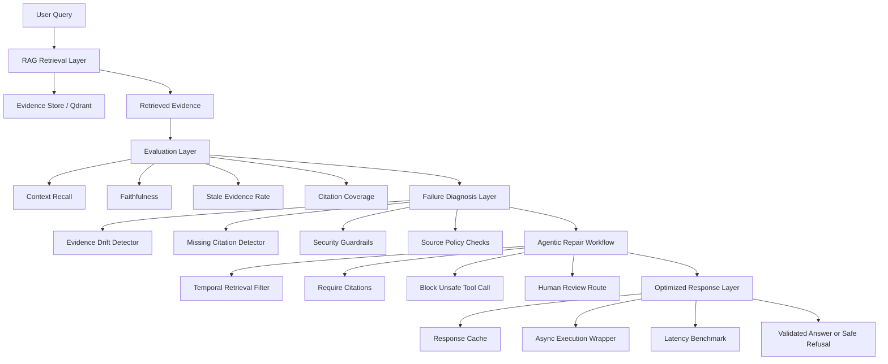

# RAGOps Sentinel Architecture

## System Purpose

RAGOps Sentinel is designed to monitor and improve Retrieval-Augmented Generation reliability. It focuses on system-level failures rather than treating the language model as the only component that matters.

## High-Level Architecture

## Major Subsystems

### 1. Retrieval and Evidence Layer

The system models retrieval as a reliability-critical component. It stores and retrieves evidence, tracks document versions, and evaluates whether generated answers are grounded in the retrieved context.

### 2. Evaluation Layer

The evaluation layer measures failure signals such as stale evidence, weak context recall, missing citation coverage, and faithfulness risk.

### 3. Agentic Diagnosis and Repair

LangGraph/LangChain-style workflows route detected failures to targeted repair actions. The system does not use a generic retry strategy; it maps failure types to specific remediation paths.

### 4. Security Guardrails

The project includes deterministic checks for prompt injection, unsafe tool calls, PII redaction, source allowlisting, and citation-required responses.

### 5. Cloud Provider Abstraction

Managed cloud LLM providers are abstracted behind a common interface. The repository includes mock, AWS Bedrock-style, and OpenAI-compatible provider patterns without hardcoded secrets.

### 6. Fine-Tuning-Ready Failure Router

The project includes an instruction-tuning dataset and LoRA/PEFT-ready training script for failure routing. CI validates the dataset and training plan without requiring GPU training.

### 7. Deployment Packaging

The repository includes Kubernetes manifests, Helm chart packaging, Terraform AWS templates, Docker validation, and GitHub Actions CI checks.

### 8. Inference Optimization

The system includes deterministic response caching, async cached execution, and latency benchmarking to demonstrate inference optimization patterns.

## Validation Strategy

The project uses automated tests and validators for:

- Python unit tests
- Kubernetes manifests
- Airflow DAG structure
- PySpark-compatible preprocessing job
- Security guardrails
- LLM provider abstraction
- Fine-tuning dataset and training plan
- Helm/Terraform deployment packaging
- Inference optimization benchmark
- Docker build validation in GitHub Actions

## Honest Limitation

The architecture is implemented as a local and CI-validated engineering prototype. Helm and Terraform files are deployment templates. They should not be described as live production infrastructure unless installed and validated on an actual cluster/cloud account.
